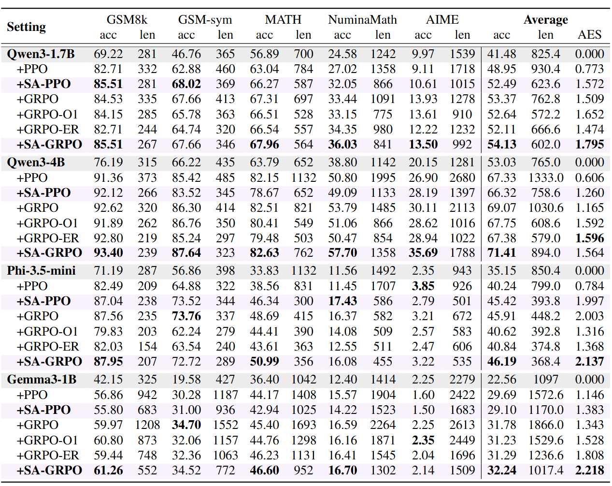

--------------------------------------------------------------------------------

## Abstract
Reinforcement learning with verifiable rewards has significantly advanced reasoning with large language models (LLMs) in domains such as mathematics and logic. However, verifiable signals provide only coarse-grained or binary correctness feedback. This limitation results in inefficiencies like overly verbose or repetitive reasoning. Existing length-based solutions (e.g., length penalty) compromise accuracy. To address this deficiency, we introduce **self-aligned reward (SAR)**, a generic, universally applicable self-guided signal that complements verifiable rewards to enhance both reasoning accuracy and efficiency in RL. Specifically, SAR is defined as the relative perplexity difference between an answer conditioned on the query and the standalone answer, thereby favoring responses that are concise and query-specific. Quantitative analysis reveals that SAR reliably judges answer quality: concise, correct answers score higher than redundant ones, and partially correct answers score higher than entirely incorrect ones. Evaluation on 4 different models across 7 benchmarks shows that integrating SAR with prevalent RL algorithms like PPO and GRPO reduces answer length by 30\%, while improving accuracy by 4\%. Our analysis also shows that SAR generalizes well to out-of-domain tasks and achieves a Pareto-optimal frontier between correctness and efficiency compared to state-of-the-art baselines. We also show that SAR shortens unnecessary elaboration while preserving advanced reasoning behaviors. These results highlight the promise of self-aligned reward as a fine-grained complement to verifiable rewards, paving the way for efficient and effective LLM training.

## Formulation

$$
R_{\text{SA-GRPO}}(q,a_i,gt) = R_{\text{VR}} + \alpha R_{\text{SA}}, \quad
R_{\text{SA}} = \operatorname{clip}\!\left(
\frac{\operatorname{ppl}(a_i) - \operatorname{ppl}(a_i|q)}{\operatorname{ppl}(a_i)},\,-1,\,1
\right)
$$
$$
\quad
\operatorname{ppl}(a) = e^{-\frac{1}{|a|}\sum_{j=1}^{|a|}\log P(a_j|a_{1...j-1})}, \quad
\operatorname{ppl}(a|q) = e^{-\frac{1}{|a|}\sum_{j=1}^{|a|}\log P(a_j|q,a_{1...j-1})}$$

## Results

